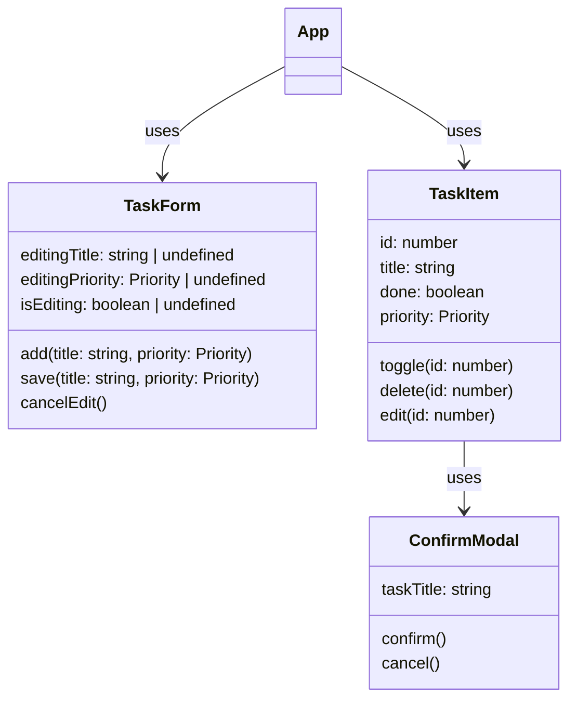
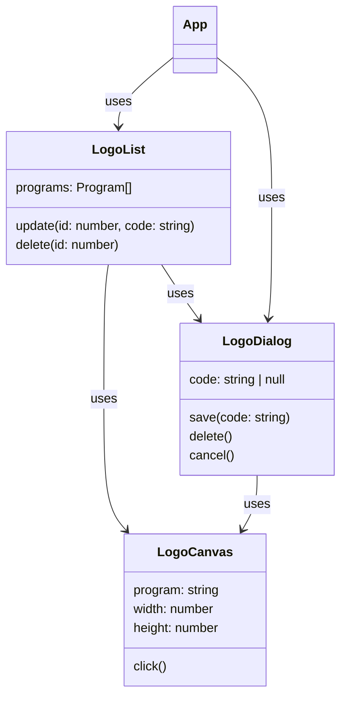

# Pregled biblioteke Vue

Cilj je upoznati se s osnovama Vue.js frameworka. Nakon što prođemo osnovne koncepte, izradit ćemo aplikaciju za upravljanje zadacima (To-do lista). Aplikaciju ćemo najprije izraditi koristeći čisti HTML i CSS, a zatim refaktorirati koristeći Vuetify biblioteku komponenti. 

## Potrebni alati

- Računalo koje ćete koristiti za rad na kolegiju. Svi materijali pretpostavljaju da radite na Linuxu. Za Mac će postupci biti uglavnom isti ili slični. Za Windowse, postavite WSL (Windows Subsystem for Linux) i sve alate (NVM/Node) instalirajte unutar WSL-a. Također, neka je vaš kod na 'disku' WSL-a. I dalje možete koristiti svoj IDE (JetBrains, VS Code, ...).
- [Node.js](https://nodejs.org/) verzije 24 ili noviji. Preporuka: umjesto da instalirate Node.js direktno, instalirajte [NVM](https://github.com/nvm-sh/nvm) kako biste mogli koristiti više Node verzija na istom računalu. Kroz NVM možete instalirati Node 25:

```bash
nvm install 25
nvm use 25
```

Provjerite instalaciju:

```bash
node --version   # trebao bi ispisati v25.x.x
npm --version    # npm dolazi s Node.js instalacijom
```

## Stvaranje projekta

Za stvaranje frontend projekta koristimo Vite.
On ima dvije ključne uloge:
1. Sadrži tzv. development server. Njegovim pokretanjem frontend će biti dostupan na URL-u `http://localhost:5173`. Kad napravimo promjenu u izvornom kodu, development server to detektira i automatski osvježava stranicu (*hot reload*).
2. Sadrži build alat koji iz izvornog koda generira statičke resurse (HTML, CSS, JavaScript) optimizirane veličine.

Pokrenite sljedeće kako biste stvorili novi Vue.js TypeScript projekt:

```bash
npm init vite@latest to-do-lista -- --template vue-ts
```

Na pitanja možete odgovoriti sa zadanim odgovorima. Projekt će se odmah i pokrenuti, zaustaviti ga možete s `Ctrl + C`.

Development server možete ponovno pokrenuti kasnije:

```bash
npm run dev
```

Otvorite [http://localhost:5173](http://localhost:5173) u pregledniku. Trebali biste vidjeti hello-world Vite/Vue projekt.

### TypeScript

TypeScript je 'konzervativna' nadogradnja JavaScripta: sav JavaScript je i validan TypeScript. Jedina razlika je u tome što TypeScript radi statičku provjere tipova, npr. upozorit će nas ako koristimo `Boolean` na mjestu gdje se očekuje `String`. Neke biblioteke, uključno s Vueom, imaju dublju 'integraciju' s TypeScriptom, tj. TypeScript sintaksa koju pišemo imat će neke efekte na ponašanje aplikacije, ne samo na kompilaciju (primjerice, Vue funkcije `defineProps` i `defineEmits` koje ćemo vidjeti kasnije).

Provjeru tipova u projektu možemo pokrenuti s:

```bash
npx vue-tsc -b
```

Na ovom kolegiju materijali će biti pisani u TypeScriptu, ali sasvim je u redu ako ne koristite TypeScript i pišete JavaScript. Ako koristite TypeScript, ali želite ignorirati greške tipova na određenom dijelu koda, možete koristiti `// @ts-ignore` i `// @ts-nocheck` direktive, ili pokrenuti kompilaciju bez provjere tipova.

```ts
// @ts-ignore
const y: number = "hello"
```

Alternativno, na vrhu datoteke možete dodati `// @ts-nocheck` da isključite provjere za cijelu datoteku.

Konačno, ako želite kompilirati projekt bez obzira na probleme oko tipova, možete pokrenuti sljedeće:
```bash
npx vite build
```

Uobičajenu kompilaciju projekta radimo s `npm run build`, što je kratica za `npx vue-tsc -b && npx vite build`, tj. prvo se provjeravaju tipovi, a tek onda gradi projekt.

Kratak pregled TypeScript sintakse:
* **Osnovni tipovi:**
    `let text: string = "Hello"; let num: number = 42; let active: boolean = true;`
* **Funkcije i lambda funkcije:**
    `function sum(a: number, b?: number): number { return a + (b ?? 0); }`
    `const print = (message: string): void => console.log(message);`
* **Liste:**
    `let numbers: number[] = [1, 2, 3];`
* **Objekti (s poznatom shemom):**
    `type User = { name: string; optionalNum?: number; };`
* **Objekti (mape)**
    `let obj: Record<string, number> = { "key1": 2 };`
* **Novouvedeni tip za mape:**
    `let dictionary: Map<string, number> = new Map([["key1", 2]]);`
* **N-torke (*tuples*):**
    `let orderedPair: [number, string] = [1, "Ivan"];`
* **Unije tipova:** `let numberOrTextOrNull: number | string | null = "ABC";`
* **Literali:** `let status: "success" | "error";`
* **Any:** `let something: any = functionWithComplexOutput();`
* **Cast:** `let numberOrTextOrNull: number | string | null = Math.random() < 0.5 ? "text" : 123;
let length = (numberOrTextOrNull as string).length;`

### Struktura projekta

Datoteka `index.html` sadrži `<div id="app"></div>` element u koji će Vue postaviti aplikaciju. Datoteka `src/main.ts` je ulazna točka koja stvara i postavlja glavnu Vue komponentu (naša se zove App). Komponenta App definirana je u `src/App.vue`.

```ts
import { createApp } from 'vue'
import App from './App.vue'

createApp(App).mount('#app')
```

Funkcija `createApp()` stvara novu Vue aplikaciju. Prima korijensku komponentu (`App`) kao argument. Metoda `.mount('#app')` postavlja spomenutu komponentu u DOM element čiji je`id` jednak `"app"` (taj je element definiran u `index.html`). 

## Sintaksa Vue (.vue) datoteka

Vue datoteke (tzv. *Single-File Components*)  sastoje se od tri opcionalna dijela:
1. `<script setup lang="ts">`: inicijalizacija komponente i sav TypeScript (ili JavaScript) kod.
2. `<template>`: HTML predložak s proširenom Vue sintaksom koji definira strukturu korisničkog sučelja.
3. `<style>`: CSS stilovi koji se primjenjuju na tu komponentu.

Zamijenite sadržaj `src/App.vue` sljedećim kodom:

```vue
<script setup lang="ts">
// Ovo nije doslovno učitavanje slike, 
// već način na koji referiramo na statičke resurse poput slika. 
// Evaluirati će se u string s relativnom putanjom do slike.
import vueLogo from './assets/vue.svg' 
const appName = 'To-do List'
const rawHtml = '<em>Vue.js</em> app'
</script>

<template>
  <h1>{{ appName }}</h1>
  <p>This is a <span v-html="rawHtml"></span>.</p>
  
  
</template>
```

Dvostruke vitičaste zagrade `{{ }}` (tzv. mustache interpolacija) ispisuju vrijednost JavaScript izraza kao tekst. Vue će osigurati da se sadržaj prikazuje kao tekst, čak i ako sadrži HTML kod.

Direktiva `v-html` može se koristiti za evaluaciju HTML-a. Trebalo bi ju izbjegavati, jer ako nismo potpuno sigurni da je string koji šaljemo `v-html` direktivi siguran, može se dogoditi da u korisničkom pregledniku evaluiramo maliciozan kod.

Direktiva `v-bind` (ili skraćeno `:`) dinamički postavlja HTML atribute. U primjeru `:src="vueLogo"` postavlja `src` atribut slike na vrijednost varijable `imageUrl`.

## Reaktivnost: `ref()`

Varijable deklarirane u `<script setup>` u prethodnom primjeru nisu 'reaktivne'. Tj., ako im promijenimo vrijednost, Vue neće ponovno iscrtati predložak. Za reaktivnost koristimo `ref()`:

```vue
<script setup lang="ts">
import { ref } from 'vue'

const count = ref(0)

function increment() {
  ++count.value
}
</script>

<template>
  <p>Counter: {{ count }}</p>
  <button @click="increment">+1</button>
</template>
```

Funkcija `ref()` vraća objekt s `.value` svojstvom. U `<script setup>` bloku pristupamo vrijednosti kroz `.value`, ali u predlošku Vue automatski "odmotava" referencu i možemo (tj. moramo) pisati `{{ count }}` umjesto `{{ count.value }}`.

Kad se `.value` promijeni, Vue automatski ponovno iscrtava sve dijelove predloška koji su promijenjeni. Zbog ovoga se kaže da je Vue 'state-driven', 'data-driven' ili 'deklarativan': ne opisujemo kako se DOM mijenja (koje HTML elemente treba dodati/promijeniti/obrisati), već definiramo stanje (*state*), a Vue se brine o tome da DOM uvijek odražava trenutno stanje.

Ne trebaju sve varijable u Vue komponenti biti reaktivne (reference), već samo one čija promjena izravno ili neizravno utječe na sučelje.

## Izvedeno stanje (`computed`)

Zamijenite `App.vue`:

```vue
<script setup lang="ts">
import { ref, computed } from 'vue'

type Task = {
  id: number
  title: string
  done: boolean
}

const tasks = ref<Task[]>([
  { id: 1, title: 'Learn Vue', done: true },
  { id: 2, title: 'Create Vue project', done: false },
  { id: 3, title: 'Build Vue project', done: false },
])

const totalTasks = computed(() => tasks.value.length)
const doneTasks = computed(() => tasks.value.filter(t => t.done).length)
const pendingTasks = computed(() => totalTasks.value - doneTasks.value)
</script>

<template>
  <h1>To-do List</h1>
  <p>Total: {{ totalTasks }} | Done: {{ doneTasks }} | Remaining: {{ pendingTasks }}</p>
</template>
```

`computed()` stvara izvedeno stanje, vrijednost koja se automatski izračunava na temelju referenci i drugih izvedenih stanja. Vue prati ovisnosti (ovo je praćenje, možda iznenađujuće, moguće postići bez ikakve statičke analize koda) i ponovno izračunava vrijednosti po potrebi. 

Još jedan primjer koji pokazuje da Vue ponovno izračunava izvedeno stanje samo kad je to nužno.

```vue
<script setup lang="ts">
import { ref, computed } from 'vue'

const a = ref(1)
const b = ref(2)
const useA = ref(true)

const result = computed(() => {
  console.log('computed')
  return useA.value ? a.value : b.value
})
</script>

<template>
  <p>result = {{ result }}</p>
  <button @click="++a">++a</button>
  <button @click="++b">++b</button>
  <button @click="useA = !useA">toggle a/b</button>
</template>
```

Kad je `useA` istinit, `computed` ovisi samo o `a` i `useA`, pa promjena `b` neće pokrenuti ponovni izračun. Kad `useA` postavimo na `false`, `computed` sad ovisi o `b` i `useA`, a promjena `a` više nema efekta.

## Dinamički stilovi

Vue omogućuje dinamičko postavljanje CSS klasa i stilova.

```vue
<script setup lang="ts">
import { ref } from 'vue'

const isActive = ref(true)
const hasError = ref(false)
const fontSize = ref(16)
</script>

<template>
  <!-- Objekt-sintaksa za CSS klase: klasa se dodaje ako je uvjet ispunjen -->
  <div :class="{ active: isActive, 'text-error': hasError }">
    Sample text (depends on active, error)
  </div>

  <!-- Lista-sintaksa za CSS klase: uvijek prisutne klase i dodane dinamičke -->
  <div :class="['underline', { active: isActive }]">
    Sample with array (depends on underline, active)
  </div>

  <!-- CSS stil -->
  <p :style="{ fontSize: fontSize + 'px', color: hasError ? 'red' : 'black' }">
    Dynamic style (depends on font size, error)
  </p>

  <!-- CSS stil kao običan string -->
  <p :style="'font-size: ' + fontSize + 'px; color: ' + (hasError ? 'red' : 'black')">
    Dynamic style as string (depends on font size, error)
  </p>

  <button @click="isActive = !isActive">Toggle Active</button>
  <button @click="hasError = !hasError">Toggle Error</button>
  <button @click="fontSize += 2">Increase Font Size</button>
</template>

<style>
.active { font-weight: bold; color: green; }
.text-error { color: red; }
.underline { text-decoration: underline; }
</style>

```

`:class` prima objekt (ključ je ime klase, vrijednost je uvjet) ili polje. `:style` prima objekt s CSS svojstvima u camelCase obliku ili uobičajen CSS string.


## Uvjetno prikazivanje

`v-if`, `v-else-if` i `v-else` kontroliraju hoće li se element stvoriti u DOM-u. Ako želimo da je element prisutan, ali možda skriven, koristimo `v-show`.

```vue
<script setup lang="ts">
import { ref } from 'vue'

const status = ref<'loading' | 'empty' | 'ready'>('ready')
const showDetails = ref(false)
</script>

<template>
  <div v-if="status === 'loading'">Loading...</div>
  <div v-else-if="status === 'empty'">No tasks</div>
  <div v-else>Tasks loaded</div>

  <!-- v-show: element je uvijek u DOM-u, samo mu se mijenja vidljivost -->
  <p v-show="showDetails">These are details that can be hidden</p>

  <button @click="status = 'loading'">Set to Loading</button>
  <button @click="status = 'empty'">Set to Empty</button>
  <button @click="status = 'ready'">Set to Ready</button>
  <button @click="showDetails = !showDetails">
    {{ showDetails ? 'Hide' : 'Show' }} details
  </button>
</template>
```

Koristite `v-if` kad se uvjet rijetko mijenja (izbjegava stvaranje nepotrebnih elemenata). Koristite `v-show` kad se uvjet često mijenja (izbjegava sporo ponavljano stvaranje i uklanjanje elemenata).

## Prikazivanje lista

`v-for` iterira po listi i prikazuje po jedan HTML element ili Vue komponentu za svaki element kolekcije.

```vue
<script setup lang="ts">
import { ref } from 'vue'

type Task = {
  id: number
  title: string
  done: boolean
}

const tasks = ref<Task[]>([
  { id: 1, title: 'Learn Vue', done: true },
  { id: 2, title: 'Create Vue project', done: false },
  { id: 3, title: 'Pass the exam', done: false },
])

function removeTask(id: number) {
  tasks.value = tasks.value.filter(t => t.id !== id)
}
</script>

<template>
  <h1>To-do List</h1>
  <ul>
    <li v-for="task in tasks" :key="task.id">
      {{ task.title }}
      <button @click="removeTask(task.id)">Delete</button>
    </li>
  </ul>
  <p v-if="tasks.length === 0">No tasks</p>
</template>
```

Atribut `:key` je obavezan i treba ga postaviti na vrijednost koja je jedinstvena. Nijedan drugi element, bilo trenutno prisutan ili budući, ne smije imati istu vrijednost ključa. Vue koristi ključ za praćenje identiteta elemenata prilikom mijenjanja liste. Npr. kad se u listi od tri elemenata obriše drugi element, Vue će znati da novu listu čine (bivši) prvi i treći element, a ne da je drugi element zamijenjen s trećim, a treći element obrisan. U našem primjeru to nije problem, ali da elementi u listi imaju neko stanje (npr. `input` element) i da nismo odabrali dobar `key` (npr. da smo koristili indeks unutar polja), to bi se stanje pogrešno prenijelo iz obrisanog elementa u bivši treći element:
```vue
<script setup lang="ts">
import { ref } from 'vue'

const elements = ref(["a", "b", "c"]);

function removeElement(index: number) {
  elements.value = elements.value.filter((_, elementIndex) => elementIndex !== index);
}
</script>

<template>
  <h1>To-do List</h1>
  <ul>
    <li v-for="(element, elementIndex) in elements" :key="elementIndex">
      {{ element }}
      <input />
      <button @click="removeElement(elementIndex)">Delete</button>
    </li>
  </ul>
  <p v-if="elements.length === 0">No tasks</p>
</template>
```

Sintaksa `(element, elementIndex) in elements` u svakoj iteraciji vraća i trenutni element i njegov indeks. 
Ako u ovom primjeru unesete redom vrijednosti `x`, `y`, `z` u input polja, a zatim obrišete srednji element, na prvu biste očekivali da ostanu `x` i `z`.
Zbog korištenja indeksa kao ključa, Vue će 'pogrešno' prenijeti stanje iz obrisanog elementa (b) u preostali element (c), pa će ostati `x` i `y`.

Za iteraciju po pozitivnim prirodnim brojevima 1, 2, 3, ... možete koristiti sintaksu `v-for="i in n"`.

## Događaji

Direktiva `v-on` (skraćeno `@`) definira koju funkciju ('event handler') pozvati kad se dogodi neki događaj ('event'). Npr. što napraviti kad korisnik klikne na gumb, ili kad pokuša poslati formu (`submit` event, obično se aktivira kad korisnik pritisne Enter unutar polja u formi).

```vue
<script setup lang="ts">
import { ref } from 'vue'

const count = ref(0)

function handleClick(event: MouseEvent) {
  ++count.value
  alert(`Clicked at coordinates: ${event.clientX}, ${event.clientY}`);
}

const handleSubmit = () => {
  alert('Form submitted');
};

</script>

<template>
  <!-- Inline funkcija -->
  <button @click="++count">+1 (inline function)</button>

  <!-- Funkcija definirana izvan templatea -->
  <button @click="handleClick">+1 (regular function)</button>

  <!-- Modifikatori događaja: .prevent zaustavlja zadano ponašanje za neke događaje,
       npr. preglednikovu redirekciju nakon submitanja forme -->
  <form @submit.prevent="handleSubmit">
    <button type="submit">Submit</button>
  </form>

  <!-- .once onemogućuje višestruku aktivaciju istog događaja -->
  <button @click.once="++count">Only once</button>

  <!-- Modifikatori za tipke -->
  <input @keyup.enter="console.log('Enter pritisnut')" />

  <p>Counter: {{ count }}</p>
</template>
```

Modifikatori su sufiksi koji modificiraju ponašanje direktive. Npr., `.prevent` poziva `event.preventDefault()`, dok `.stop` poziva `event.stopPropagation()`.

## Direktiva `v-model`

`v-model` stvara dvosmjerno vezanje (*two-way binding*) između stanja i komponente: ne samo da komponenti šaljemo neko stanje, već komponenta može mijenjati to stanje.
Zapravo, radi se o prividnom dvosmjernom vezanju: komponenta nikad ne može sama mijenjati vanjsko stanje.
Neke komponente ne podržavaju `v-model`. 
Više o `v-model` direktivi i tome kako stvara privid dvosmjernog vezanja vidjet ćemo nešto kasnije, zasad nas zanima samo kako izgleda korištenje komponente koja podržava `v-model`.

```vue
<script setup lang="ts">
import { ref } from 'vue'

const newTaskTitle = ref('')
const priority = ref('medium')
const isImportant = ref(false)
const notes = ref('')
const num = ref(0)

const tasks = ref<{ id: number; title: string }[]>([])
let nextId = 1

function addTask() {
  // .trim() nije nužan u ovoj funkciji jer koristimo v-model.trim
  if (!newTaskTitle.value.trim()) return
  tasks.value.push({ id: ++nextId, title: newTaskTitle.value.trim() })
  newTaskTitle.value = ''
}
</script>

<template>
  <h1>To-do List</h1>

  <form @submit.prevent="addTask">
    <!-- .trim automatski uklanja razmake s početka i kraja -->
    <input v-model.trim="newTaskTitle" placeholder="New task..." />
    <button type="submit">Add</button>
  </form>

  <ul>
    <li v-for="task in tasks" :key="task.id">{{ task.title }}</li>
  </ul>

  <hr />

  Examples of different inputs and their two-way bindings:

  <hr />

  <select v-model="priority">
    <option value="low">Low</option>
    <option value="medium">Medium</option>
    <option value="high">High</option>
  </select>

  v-model: {{ priority }}

  <hr />

  <label>
    <input type="checkbox" v-model="isImportant" /> Important
  </label>

  v-model: {{ isImportant }}

  <hr />

  <!-- Textarea s .lazy: sinkronizira tek na 'change' (blur), ne na svaku promjenu (zbog performansi) -->
  <textarea v-model.lazy="notes" placeholder="Notes..."></textarea>

  v-model: <pre>{{ notes }}</pre>

  <hr />

  <!-- Input s .number: pretvara unos u broj, npr. unos "123" postaje broj 123 -->
  <input v-model.number="num" ></input>

  v-model * 2: {{ num * 2 }}

</template>
```

Neki modifikatori za `v-model`: `.lazy` sinkronizira na `change` događaj umjesto `input` događaj, `.number` pretvara unos u broj, `.trim` uklanja razmake s početka i kraja.

## `watch` i `watchEffect`

Izvedena stanja (`computed`) prate promjene reaktivnih vrijednosti i vraćaju nova stanja. No, ponekad nam ne treba novo stanje, već izvršavanje akcije u ovisnosti o promjenama reaktivnog stanja. Primjerice, imamo aplikaciju čije stanje želimo prikazati (`template`) za što nam je dovoljno `ref` i `computed`, ali isto stanje želimo spremiti u `localStorage` kad god se promijeni. U tom slučaju možemo koristiti `watch()` i `watchEffect()`, koji prate promjene reaktivnih vrijednosti.

```vue
<script setup lang="ts">
import { ref, watch, watchEffect } from 'vue'

const value = ref(localStorage.getItem('value') ?? 'Synchronised with Local Storage')

// watch: prati jednu ili više specifičnih reaktivnih vrijednosti
watch(value, (newValue) => {
  localStorage.setItem('value', newValue)
})

// watchEffect: automatski prati sve reaktivne vrijednosti koje se koriste unutar funkcije
watchEffect(() => {
  // Isti efekt kao ranije, ali ne moramo sami pratiti koje su ovisnosti
  // localStorage.setItem('value', value.value)
})
</script>

<template>
  <div class="app">
    <textarea
        v-model="value"
        rows="50"
        :cols="80"
    />
  </div>
</template>
```

`watch()` prima reaktivno stanje (npr. `ref`) i *callback* funkciju koja se poziva kad se vrijednost promijeni. Opcija `deep: true` omogućuje praćenje promjena na svim razinama unutar objekata (npr. na objektu `{"a": {"b": "x"}}` praćenje promjene `a.b`) ili polja (promjene svojstava elemenata unutar polja). Osim `deep: true`, često je korisna i opcija `immediate: true`. Njeno uključivanje znači da se funkcija poziva pri budućim promjenama, ali i na početku (tijekom inicijalizacije komponente).

`watchEffect()` automatski prati sve reaktivne vrijednosti korištene unutar funkcije. Ne prima eksplicitni izvor, već Vue sam detektira ovisnosti pri prvom pokretanju. Smisao eksplicitnih vrijednosti kod `watch` funkcije su situacije u kojima želimo čitati npr. reaktivne vrijednosti `a` i `b`, ali samo promjene vrijednosti `a` trebaju pokrenuti *callback* funkciju, dok promjene vrijednosti `b` ne trebaju. U tom slučaju koristimo `watch(a, callback)` umjesto `watchEffect()`, jer bi `watchEffect()` pokrenuo funkciju i kad se dogodi promjena u `b`.

**Napomena**: obično je bolje pisati kod koji ne ovisi o `watch` funkciji. Problem s `watch` konstrukcijama jest što njihovi pozivi nisu eksplicitno prisutni u kodu, pa je debuggiranje znatno teže. Stoga ako želimo uvijek izvršiti neku radnju `f()` kad se promijeni stanje `st`, obično je bolje za mijenjanje stanja `st` napraviti funkciju poput `function setSt(newValue) { st.value = newValue; f(); }` i koristiti `setSt()` umjesto direktnog mijenjanja `st.value`. Sada smo postigli isti efekt, ali kod je lakše debuggirati.

## Referenca na elemente

Osim što se reference mogu koristiti za uobičajene JavaScript vrijednosti, mogu se koristiti i za HTML elemente koji su dio našeg sučelja. Kako Vue sam stvara i upravlja DOM elementima, postupak za inicijalizaciju ovakvih referenci izgleda ovako:
1. Definiramo referencu u `<script setup>` bloku, npr. `const node = ref<HTMLEment | null>(null)`. Tip će uvijek biti oblika `html-element | null`, jer Vue ne crta sučelje prije nego izvrši čitav `<script setup>` blok, pa je `null` jedina moguća početna vrijednost.
2. Vue iscrtava sučelje. Negdje u predlošku trebamo koristiti atribut `ref="node"` na HTML elementu čiju referencu želimo. Ova posebna sintaksa znači da Vue treba postaviti `node.value` na taj element nakon što ga stvori.
3. Vrijednost `node.value` definirana je jednom kad je cijelo sučelje iscrtano.

```vue
<script setup lang="ts">
import { ref, nextTick } from 'vue'

const tasks = ref<{ id: number; title: string }[]>([
  { id: 1, title: 'A' },
  { id: 2, title: 'B' },
  { id: 3, title: 'C' },
])
const editingId = ref<number | null>(null)
const editText = ref('')
const editInput = ref<HTMLInputElement | null>(null)

async function startEditing(task: { id: number; title: string }) {
  editingId.value = task.id
  editText.value = task.title

  // Input se tek sada pojavljuje u DOM-u, moramo pričekati iscrtavanje
  await nextTick()
  // Pozivamo .focus() kako korisnik ne bi morao kliknuti na <input> element prije pisanja
  editInput.value?.focus()
}

function finishEditing() {
  const task = tasks.value.find(t => t.id === editingId.value)
  if (task) {
    task.title = editText.value.trim()
  }
  editingId.value = null
}
</script>

<template>
  Click an item to start editing:

  <ul>
    <li v-for="task in tasks" :key="task.id">
      <span @click="startEditing(task)">{{ task.title }}</span>
    </li>
  </ul>

  <div v-if="editingId !== null">
    <input
        ref="editInput"
        v-model="editText"
        @keyup.enter="finishEditing"
    />
    <button @click="finishEditing">Save</button>
  </div>
</template>
```

U gornjem primjeru koristimo `ref` kako bismo pozvali metodu `.focus()` na `input` elementu (to je DOM metoda, nije specifična za Vue). U ovom primjeru vidimo i primjer korištenja `nextTick()`, funkcije koja vraća `Promise` koji se izvršava (`resolve`) nakon što Vue završi s iscrtavanjem DOM-a. To znači da će se kod nakon `await nextTick()` izvršiti tek nakon što se `input` element pojavi u DOM-u, pa će `editInput.value` biti definiran i moći ćemo pozvati `.focus()`. Sintaksa `a?.b()` znači "ako je `a.b` definirana vrijednost, pozovi metodu `a.b()`, a inače ne radi ništa". U našem slučaju znamo da je `editInput.value?.focus` definirano, ali TypeScript ne zna da će `editInput.value` biti definiran nakon `await nextTick()`, pa koristimo ovu sintaksu da izbjegnemo TypeScript grešku.

## Zadatak 1
Koristeći `table`, `tr` i `td` elemente, iscrtajte tablicu množenja. Broj redaka i stupaca neka se unosi putem `input` elemenata (na početku neka su oba broja 10), a pritiskom `enter` tablica se treba iscrtati koristeći trenutno uneseni broj redaka i stupaca. Uneseni brojevi trebaju ostati zapisani i nakon refresha stranice. Neka se ispod tablice prikazuje tekst oblika "Broj prostih brojeva manjih od {{ redaka * stupaca }} jest {{ brojProstihBrojeva }}" gdje je `brojProstihBrojeva` izvedeno stanje (`computed`). Konačno, neka cijela tablica koristi dinamički CSS stil: ovisno o broju redaka i stupaca postavlja `zoom` na način da je tablica uvijek cijela vidljiva na vašem ekranu (čak i ako zbog toga postane nečitljiva). Ako je broj redaka ili stupaca veći od 100, neka se umjesto tablice prikaže poruka "Previše redaka/stupaca".
Provjerite da izvorni kod nema TypeScript grešaka pokretanjem `npx vue-tsc -b`.


## Komponente

Do sad smo sav Vue kod pisali u jednoj datoteci, `App.vue`. Komponente omogućuju razdvajanje korisničkog sučelja na manje dijelove.

Stvorite datoteku `src/TaskItem.vue`:

```vue
<!-- TaskItem.vue -->
<script setup lang="ts">
const props = defineProps<{
  title: string
  done: boolean
}>()
</script>

<template>
  <li :class="{ done }">
    {{ title }}
  </li>
</template>

<style scoped>
.done {
  text-decoration: line-through;
  opacity: 0.6;
}
</style>
```

Svaka `.vue` datoteka je Single-File Component (SFC) s tri opcionalne sekcije: `<script>` (logika), `<template>` (predložak) i `<style>` (stilovi).
Atribut `scoped` u `<style>` osigurava da se CSS pravila primjenjuju samo na tu komponentu.

Uključite upravo izrađenu komponentu (SFC) u `App.vue`:

```vue
<!-- App.vue -->
<script setup lang="ts">
import { ref } from 'vue'
import TaskItem from './TaskItem.vue'

type Task = {
  id: number
  title: string
  done: boolean
}

const tasks = ref<Task[]>([
  { id: 1, title: 'Learn Vue', done: true },
  { id: 2, title: 'Create Vue project', done: false },
])
</script>

<template>
  <h1>To-do List</h1>
  <ul>
    <TaskItem
      v-for="task in tasks"
      :key="task.id"
      :title="task.title"
      :done="task.done"
    />
  </ul>
</template>
```

## Životni ciklus komponente

Vue komponente prolaze kroz životni ciklus: stvaranje, postavljanje u DOM, ažuriranje i uklanjanje. 
Sve što želimo izvršiti prilikom stvaranja komponente (prva faza) stavljamo izravno u `<script setup>` blok.
Za preostale faze koristimo tzv. *lifecycle hooks*, ako želimo dodati vlastitu logiku za neku od tih faza.

```vue
<script setup lang="ts">
import { ref, onMounted, onUpdated, onUnmounted } from 'vue'

const count = ref(0)

console.log('Component is being created')

onMounted(() => {
  console.log('Component mounted to DOM')
})

onUpdated(() => {
  console.log('DOM updated, count is', count.value)
})

onUnmounted(() => {
  console.log('Component removed from DOM')
})
</script>

<template>
  <button @click="++count">{{ count }}</button>
</template>
```

Objašnjenje:
- `<script setup>`: sav kod unutar ovog bloka izvršava se tijekom stvaranja komponente. Većina inicijalizacije ide ovdje, uključno s pozivanjem backenda.
- `onMounted`: komponenta je postavljena u DOM. Inicijalizacija koja zahtijeva DOM elemente ide ovdje.
- `onUpdated`: poziva se nakon svake promjene koja uzrokuje ponovno iscrtavanje (dijela) DOM-a.
- `onUnmounted`: pogodan trenutak za čišćenje, npr. uklanjanje intervala, pretplata na događaje itd.

```vue
<script setup lang="ts">
import { ref, onUpdated } from 'vue'

const visible = ref(0)
const hidden = ref(0)

onUpdated(() => {
  // Poziva se samo kad se 'visible' promijeni, jer se samo on koristi u predlošku.
  console.log('DOM updated')
})
</script>

<template>
  <p>{{ visible }}</p>
  <button @click="++visible">change visible (triggers onUpdated)</button>
  <button @click="++hidden">change hidden (does not trigger onUpdated)</button>
</template>
```


## Svojstva (*props*)

Svojstva (*props*) su mehanizam za prosljeđivanje podataka od roditeljske komponente prema djetetu. 
Tok podataka *uvijek* je jednosmjeran: roditelj postavlja svojstva djetetu.

Svojstva sa zadanim vrijednostima:

```vue
<!-- TaskItem.vue -->
<script setup lang="ts">
const props = withDefaults(defineProps<{
  title: string
  done?: boolean
  priority?: 'low' | 'medium' | 'high'
}>(), {
  done: false,
  priority: 'low',
})
</script>

<template>
  <li :class="[`priority-${priority}`, { done }]">
    {{ title }}
  </li>
</template>

<style scoped>
.priority-low { color: green; }
.priority-medium { color: yellow; }
.priority-high { color: red; }
.done {
  text-decoration: line-through;
  opacity: 0.4;
}
</style>
```


## Događaji

Dijete ne smije izravno pristupati roditelju (mijenjati stanje ili pozivati metode roditelja).
Događaji su mehanizam za komunikaciju od djeteta prema roditelju.
Ako dijete želi poslati informaciju roditelju, poziva (*emits*) događaje (*events*).

Roditelj odlučuje hoće li i kako reagirati. Više roditelja može imati isto dijete, i svaki roditelj može drugačije reagirati na iste događaje.

Osnovna prednost: između roditelja i djeteta postoji slaba povezanost (*loose coupling*), što olakšava održavanje koda.
Programer ne mora razumijeti cijeli kod projekta kako bi razumio komponentu: dovoljno je razumjeti pojedinu komponentu, njezina svojstva i događaje.
Komponenta je odgovorna za sebe, što uključuje i korištenje njene djece (ne i implementaciju djece), ali ne i za roditelje.
Kad bi komponenta bila odgovorna za svoju djecu i svoje roditelje, postala bi odgovorna za cijelu aplikaciju.

```vue
<!-- TaskItem.vue -->
<script setup lang="ts">
const props = defineProps<{
  id: number
  title: string
  done: boolean
}>()

const emit = defineEmits<{
  toggle: [id: number]
  delete: [id: number]
}>()
</script>

<template>
  <li :class="{ done }">
    <input type="checkbox" :checked="done" @change="emit('toggle', id)" />
    {{ title }}
    <button @click="emit('delete', id)">Delete</button>
  </li>
</template>

<style scoped>
.priority-low { color: green; }
.priority-medium { color: yellow; }
.priority-high { color: red; }
.done {
  text-decoration: line-through;
  opacity: 0.4;
}
</style>
```

Roditelj se pretplaćuje na događaj koristeći `@` (kratak zapis `v-on` direktive):

```vue
<!-- App.vue -->
<script setup lang="ts">
import { ref } from 'vue'
import TaskItem from './TaskItem.vue'

type Task = {
  id: number
  title: string
  done: boolean
}

const tasks = ref<Task[]>([
  { id: 1, title: 'Learn Vue', done: false },
  { id: 2, title: 'Create Vue project', done: false },
])

function toggleTask(id: number) {
  const task = tasks.value.find(t => t.id === id)
  if (task) task.done = !task.done
}

function deleteTask(id: number) {
  tasks.value = tasks.value.filter(t => t.id !== id)
}
</script>

<template>
  <h1>To-do List</h1>
  <ul>
    <TaskItem
      v-for="task in tasks"
      :key="task.id"
      :id="task.id"
      :title="task.title"
      :done="task.done"
      @toggle="toggleTask"
      @delete="deleteTask"
    />
  </ul>
</template>
```

**Napomena**: `props` je tzv. reaktivan objekt, još jedan izvor reaktivnosti sličan referenci namijenjen isključivo objektima. 
Za razliku od referenci koje sadrže objekt, reaktivnim objektima možemo mijenjati svojstva, ali ne i sam objekt.
Za razliku od referenci, njihovim svojstvima ne pristupamo s `.value`, već direktno, npr. `reaktObj.svojstvo` umjesto `reaktObj.value.svojstvo`.
Zbog jednostavnosti mi nećemo koristiti reaktivne objekte, no za `props` objekt nema alternative.
Ako želimo napisati `watch` funkciju koja prati svojstvo, kao prvi argument funkcije `watch` moramo proslijediti **funkciju** koja vraća to svojstvo, npr. `watch(() => props.svojstvo, ...)`.

## Svojstva i događaji bez TypeScripta

Funkcije `defineProps<...>()` i `defineEmits<...>()` nisu obične funkcije. 
Vue kompajler čita tipove koje smo definirali u njihovim pozivima, i na temelju njih generira kod koji će nas tijekom izvršavanja upozoriti (u konzoli) ako npr.
proslijedimo pogrešan tip svojstva komponenti, ili pozovemo događaj nepostojećeg naziva.

No, što ako ne želimo koristiti TypeScript? Tada i dalje pozivamo funkcije `defineProps()` i `defineEmits()`, ali bez tipova:
```vue
<script setup lang="ts">
const props = defineProps({
  title: String,
  done: Boolean,
})

const emit = defineEmits(['toggle', 'delete'])
</script>
```
U ovom primjeru ne koristimo TypeScript. Ključne riječi `String` i `Boolean` predstavljaju uobičajene JavaScript objekte.
Moguće su i složenije sintakse kojima možemo definirati zadane (*default*) vrijednosti itd.

## Direktiva `v-model`

`v-model` na komponenti stvara (prividno) dvosmjerno vezanje stanja: umjesto da definiramo svojstvo i obradu događaja zasebno, koristimo jednu direktivu, `v-model`.

Kad napišemo primjerice `<input v-model="text" />`, Vue će to zamijeniti s `<input :value="text" @input="(event: InputEvent) => text.value = event.target.value" />`.
Točan oblik funkcije koja obrađuje događaj ovisi o komponenti, u ovom primjeru radi se o ugrađenom `<input>` elementu.
Za ugrađene HTML elemente koristi se svojstvo `value` te ugrađeni događaji `input` i `change`, ovisno o elementu.

Za Vue komponente, koristi se svojstvo `modelValue` i događaj `update:modelValue`.
U slučaju da želimo koristiti `v-model` direktivu na drugom svojstvu, npr. `title`, onda Vue očekuje da postoji svojstvo `title` i događaj `update:title`.
U oba slučaja (`modelValue` i druga svojstva) možemo koristiti funkciju `defineModel()` unutar `<script setup>` bloka kako bismo odjednom definirali i svojstvo i događaj.

```vue
<!-- App.vue -->
<script setup lang="ts">
import { ref } from 'vue'
import TaskItem from './TaskItem.vue'

type Task = {
  id: number
  title: string
  done: boolean
}

const tasks = ref<Task[]>([
  { id: 1, title: 'Learn Vue', done: false },
  { id: 2, title: 'Create Vue project', done: false },
])

function deleteTask(id: number) {
  tasks.value = tasks.value.filter(t => t.id !== id)
}
</script>

<template>
  <h1>To-do List</h1>
  <ul>
    <TaskItem
        v-for="task in tasks"
        :key="task.id"
        :id="task.id"
        v-model:title="task.title"
        v-model:done="task.done"
        @delete="deleteTask"
    />

    <input @input="(event: InputEvent) => (console.log(event))" />
  </ul>
  <pre style="text-align: left;">{{ JSON.stringify(tasks, null, 2) }}</pre>
</template>
```
```vue
<!-- TaskItem.vue -->
<script setup lang="ts">
const props = defineProps<{
  id: number
}>()

const emit = defineEmits<{
  delete: [id: number]
}>()

const done = defineModel<boolean>('done')
const title = defineModel<string>('title')
</script>

<template>
  <li :class="{ done }">
    <input type="checkbox" v-model="done" />
    <input v-model="title" />
    <button @click="emit('delete', id)">Delete</button>
  </li>
</template>

<style scoped>
.priority-low { color: green; }
.priority-medium { color: yellow; }
.priority-high { color: red; }
.done {
  text-decoration: line-through;
  opacity: 0.4;
}
</style>
```

## Primjer aplikacije: To-do lista

Možemo spojiti sve spomenute koncepte u jednostavnu aplikaciju.


```vue
<!-- App.vue -->
<script setup lang="ts">
import { ref, computed, watchEffect } from 'vue'
import TaskForm from './TaskForm.vue'
import TaskItem from './TaskItem.vue'

type Task = {
  id: number
  title: string
  done: boolean
}

// Učitavanje stanja iz localStoragea
const savedInitialTasks = localStorage.getItem('tasks')
const savedInitialNextId = localStorage.getItem('nextId')
let parsedInitialTasks: Task[] = [], parsedInitialNextId = 1
if (savedInitialTasks) {
  parsedInitialTasks = JSON.parse(savedInitialTasks)
}
if (savedInitialNextId) {
  parsedInitialNextId = parseInt(savedInitialNextId, 10)
}

const tasks = ref<Task[]>(parsedInitialTasks)
const filter = ref<'all' | 'active' | 'done'>('all')
const nextId = ref<number>(parsedInitialNextId);

const filteredTasks = computed(() => {
  switch (filter.value) {
    case 'active': return tasks.value.filter(t => !t.done)
    case 'done': return tasks.value.filter(t => t.done)
    default: return tasks.value
  }
})

const stats = computed(() => ({
  total: tasks.value.length,
  done: tasks.value.filter(t => t.done).length,
  active: tasks.value.filter(t => !t.done).length,
}))

function addTask(title: string) {
  tasks.value.push({ id: ++nextId.value, title, done: false })
}

function toggleTask(id: number) {
  const task = tasks.value.find(t => t.id === id)
  if (task) task.done = !task.done
}

function deleteTask(id: number) {
  tasks.value = tasks.value.filter(t => t.id !== id)
}

// Spremanje stanja u localStorage
watchEffect(() => {
  localStorage.setItem('tasks', JSON.stringify(tasks.value))
  localStorage.setItem('nextId', nextId.value.toString())
})

</script>

<template>
  <div class="app">
    <h1>To-do List</h1>

    <TaskForm @add="addTask" />

    <div class="filters">
      <button
          v-for="f in (['all', 'active', 'done'] as const)"
          :key="f"
          :class="['btn-filter', { active: filter === f }]"
          @click="filter = f"
      >
        {{ f === 'all' ? 'All' : f === 'active' ? 'Active' : 'Done' }}
      </button>
    </div>

    <p class="stats">
      Total: {{ stats.total }} | Active: {{ stats.active }} | Done: {{ stats.done }}
    </p>

    <div class="task-list" v-if="filteredTasks.length > 0">
      <TaskItem
          v-for="task in filteredTasks"
          :key="task.id"
          :id="task.id"
          :title="task.title"
          :done="task.done"
          @toggle="toggleTask"
          @delete="deleteTask"
      />
    </div>
    <p v-else class="empty">No tasks to display.</p>
  </div>
</template>

<style>
body { font-family: system-ui, sans-serif; background: #f5f5f5; }
.app { max-width: 500px; margin: 40px auto; padding: 24px 48px 48px 48px; background: white; border-radius: 8px; border: 1px solid #c9c9c9; }
h1 { margin-bottom: 24px; color: #2c3e50; }
.filters { display: flex; gap: 8px; margin-bottom: 12px; }
.btn-filter { background: #eee; border: none; padding: 6px 12px; border-radius: 4px; cursor: pointer; }
.btn-filter.active { background: green; color: white; }
.stats { color: #666; font-size: 14px; margin-bottom: 12px; }
.empty { color: #999; text-align: center; padding: 24px; }
</style>
```
```vue
<!-- TaskForm.vue -->
<script setup lang="ts">
import { ref } from 'vue'

const emit = defineEmits<{
  add: [title: string]
}>()

const inputRef = ref<HTMLInputElement | null>(null)
const newTitle = ref('')

function submit() {
  const trimmed = newTitle.value.trim()
  if (!trimmed) return
  emit('add', trimmed)
  newTitle.value = ''
  inputRef.value?.focus()
}
</script>

<template>
  <form @submit.prevent="submit" class="task-form">
    <input
        ref="inputRef"
        v-model.trim="newTitle"
        placeholder="New task..."
        class="task-input"
    />
    <button type="submit" class="btn-add">Add</button>
  </form>
</template>

<style scoped>
.task-form { display: flex; gap: 8px; margin-bottom: 16px; }
.task-input { flex: 1; padding: 8px; border: 1px solid #ccc; border-radius: 4px; }
.btn-add { padding: 8px 16px; border: none; border-radius: 4px; cursor: pointer; background: green; color: white; }
</style>
```
```vue
<!-- TaskItem.vue -->
<script setup lang="ts">
const props = defineProps<{
  id: number
  title: string
  done: boolean
}>()

const emit = defineEmits<{
  toggle: [id: number]
  delete: [id: number]
}>()
</script>

<template>
  <div :class="['task-item', { done }]">
    <label>
      <input type="checkbox" :checked="done" @change="emit('toggle', id)" /> <span class="task-title">{{ title }}</span>
    </label>
    <button class="btn-delete" @click="emit('delete', id)">Delete</button>
  </div>
</template>

<style scoped>
.task-item {
  display: flex;
  align-items: center;
  justify-content: space-between;
  gap: 8px;
  padding: 8px;
  border-bottom: 1px solid #eee;
}
.task-item.done .task-title { text-decoration: line-through; opacity: 0.4; }
.btn-delete { background: none; border: none; color: red; font-size: 18px; cursor: pointer; }
</style>
```

## Zadatak 2
Dodajte mogućnost dodjele prioriteta zadacima (Low, Medium, High), te filtriranje u ovisnosti o prioritetu.
Zadaci trebaju biti obojani ovisno o prioritetu.
Kad se pokuša obrisati nezavršeni zadatak visokog prioriteta, neka aplikacija pita korisnika za potvrdu.
Za potvrdu stvorite vlastitu komponentu koja se prikazuje kao modalni prozor (npr. `<div>` s `position: fixed; z-index: 10;`).
Ta komponenta treba primiti svojstvo s tekstom zadatka, te treba imati događaje za potvrdu i odustajanje.
Konačno, pokraj `Delete` gumba dodajte `Edit` gumb. 
Klikom na `Edit`, polje za unos novog zadatka postaje polje za uređivanje postojećeg zadatka, a gumb `Add` postaje `Save`. Uz `Save` gumb dodajte i `Cancel` gumb kojim se odustaje od uređivanja.
Provjerite da izvorni kod nema TypeScript grešaka pokretanjem `npx vue-tsc -b`.

### Dijagram rješenja


## Zadatak 3
Programi napisani u programskom jeziku Logo imaju dostupnu 2D površinu za crtanje. 
Na početku izvršavanja programa "kornjača" se nalazi u sredini dostupne površine na koordinatama (0, 0) i 'gleda' prema gore. 
Koristeći Logo naredbe možemo pomicati kornjaču i tako crtati sliku (kornjača ostavlja trag na površini).
Primjerice, pravokutnik sa stranicama duljine 200 i 400 [možemo nacrtati](https://www.calormen.com/jslogo/) sljedećim naredbama:
```logo
FD 200 
RT 90 
FD 400 
RT 90 
FD 200
RT 90 
FD 400 
```
Izradite Vue komponentu `LogoCanvas.vue` koja crta sliku na temelju Logo programa.
Koristite `<canvas>` element za crtanje.
LogoCanvas treba imati jedan događaj koji se aktivira klikom bilo gdje na površini.
LogoCanvas kao svojstvo prima program u obliku stringa te fizičke dimenzije (cijeli brojevi izraženi u pikselima).
Dovoljno je podržati naredbe oblika `FD <int>` (kretanje naprijed za dani iznos), `RT <int>` (okretanje za dani kut udesno) i `LT <int>` (okretanje za dani kut ulijevo).
Ako primljeni program iz bilo kojeg razloga nije ispravan, nije nužno išta ispisati/iscrtati.
Fizičke dimenzije odnose se samo na prostor koji slika zauzima na stranici,
kornjača neka koristi koordinatni sustav u kojem su koordinate (-1000, -1000) donji lijevi kut, a (1000, 1000) gornji desni kut.

Zatim, izradite komponentu `LogoDialog.vue` koja prikazuje dijaloški okvir, te unutar njega koristi `LogoCanvas` komponentu i `<textarea>` element za uređivanje Logo programa.
Uređivanjem teksta ažurira se iscrtana slika.
Dijalog treba imati gumbe za spremanje i brisanje programa, i odustajanje od promjena.
Gumb za brisanje ne prikazuje se kod novih programa.
Svojstva su program koji treba prikazati (`null` ako je program nov), a događaji spremanje (poziva se tek kad korisnik klikne na gumb za spremanje), brisanje i odustajanje od promjena. 

Izradite i Vue komponentu `LogoList.vue` koja prikazuje niz do sada izrađenih Logo programa u obliku sličica (ponovno LogoCanvas komponenta), horizontalno poredanih jedan do drugoga, s prelaskom u novi red kad ponestane mjesta.
Klikom na sličicu otvara se LogoDialog komponenta, gdje se može uređivati program.
Svojstva su lista Logo programa (gdje je pojedini program `{id: number, code: string}`), a događaji mijenjanje i brisanje programa.
Alternativno, događaj može biti samo selekcija programa, pa će roditelj ove komponente (`App.vue`) biti odgovoran za dijaloški okvir.

U glavnoj komponenti treba se nalaziti `LogoList` komponenta i gumb za stvaranje novog programa.

### Dijagram rješenja

